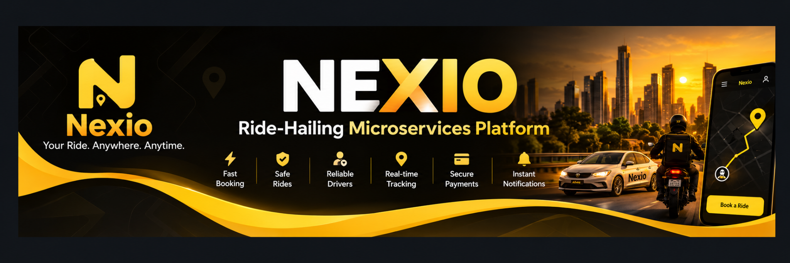
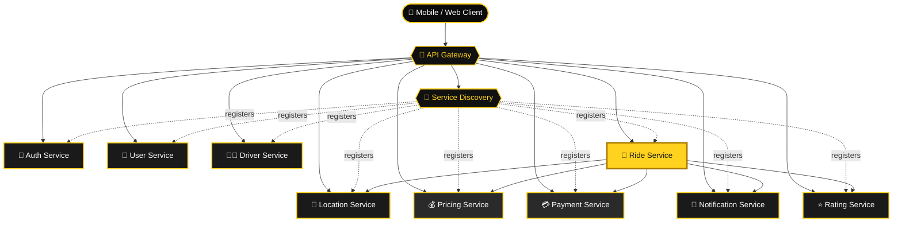
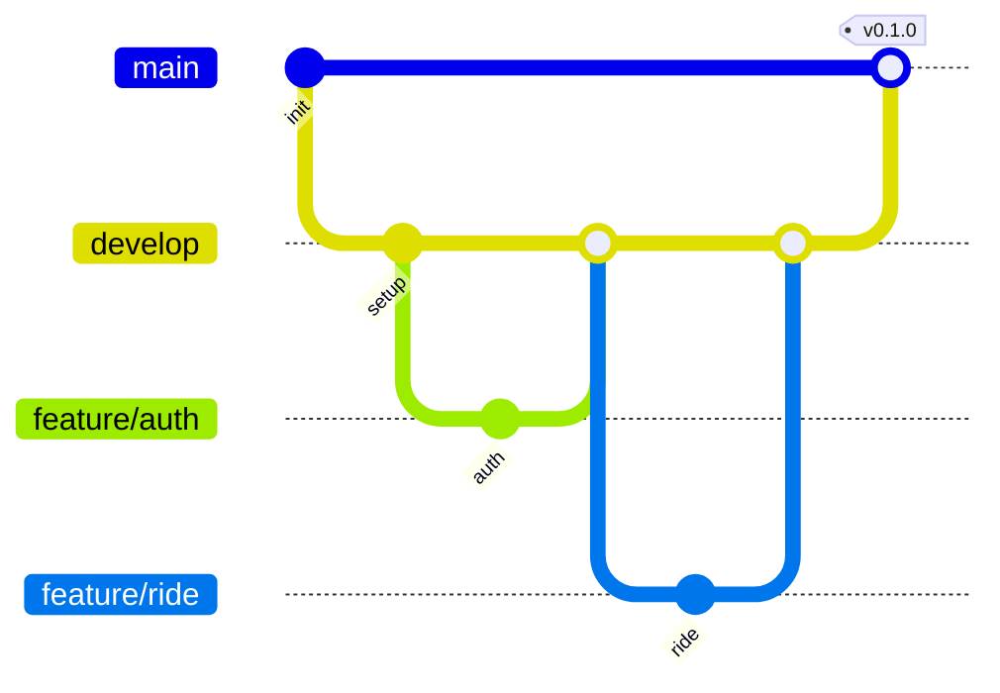

<div align="center">



</div>

---

## ✨ Overview

**Nexio** is a ride-hailing platform built with **Java 21 and Spring Boot**, organized as a set of independently deployable microservices.

The current project models the rider and driver journey:

> 📱 Account creation → 🚖 Ride booking → 🧭 Driver assignment → 📍 Live tracking → 💳 Payment → ⭐ Rating → 🕘 Ride history

> [!NOTE]
> **Project status: 🚧 Active development.** The repository contains service foundations and is being implemented incrementally. Some integrations and distributed-system features listed in the roadmap are planned rather than fully implemented.

---

## 📱 Product Flow

<div align="center">


</div>


| ⚫ Onboarding | 🟡 Booking | 🟨 Trip | ⚪ Completion |
|:--|:--|:--|:--|
| Splash / Welcome | Home / Book a Ride | Live trip tracking | Payment |
| Mobile number entry | Destination selection | Driver arrival | Payment success |
| OTP verification | Fare & vehicle selection | Ride in progress | Ride rating |
| User profile creation | Driver search | Destination reached | Ride history |
| Location permission | Driver assignment | | Profile / Wallet / Settings |
| Bank account / payout setup | | | |

---

## 🧩 Microservices

| | Service | Responsibility |
|:-:|:--|:--|
| 🚪 | `nexio-api-gateway` | Single entry point and request routing |
| 🧭 | `nexio-service-discovery` | Service registration and discovery |
| 🔐 | `nexio-auth-service` | Authentication, OTP, JWT, refresh tokens, and account security |
| 👤 | `nexio-user-service` | User profile and user-related operations |
| 🧑‍✈️ | `nexio-driver-service` | Driver registration and driver management |
| 🚖 | `nexio-ride-service` | Ride booking, matching, trip lifecycle, and ride state |
| 📍 | `nexio-location-service` | Real-time location and trip tracking |
| 💰 | `nexio-pricing-service` | Fare calculation and pricing rules |
| 💳 | `nexio-payment-service` | Payment and transaction processing |
| 🔔 | `nexio-notification-service` | Notifications such as SMS, email, and push |
| ⭐ | `nexio-rating-service` | Rider and driver ratings / reviews |

---

## 🏗️ Architecture



---

## 🛠️ Technology Stack

### ☕ Backend

- Java 21
- Spring Boot
- Spring Security
- Spring Data JPA / Hibernate
- REST APIs
- Maven
- PostgreSQL

### ☁️ Distributed Systems & Infrastructure

- Spring Cloud
- Service Discovery
- API Gateway
- Kafka *(planned / being integrated)*
- Redis *(planned / being integrated)*
- WebSocket *(planned / being integrated)*
- Docker *(planned / being integrated)*
- Kubernetes *(planned)*

### 🧪 API Testing

- Postman

--- 

## 📂 Repository Structure

```text
nexio-microservices/
│
├── 🚪 nexio-api-gateway/
├── 🔐 nexio-auth-service/
├── 🧑‍✈️ nexio-driver-service/
├── 📍 nexio-location-service/
├── 🔔 nexio-notification-service/
├── 💳 nexio-payment-service/
├── 💰 nexio-pricing-service/
├── ⭐ nexio-rating-service/
├── 🚖 nexio-ride-service/
├── 🧭 nexio-service-discovery/
├── 👤 nexio-user-service/
│
├── 📬 postman/
├── 📚 docs/
├── 🙈 .gitignore
└── 📄 README.md
```

---

## 🚀 Getting Started

### 📋 Prerequisites

| Required | Optional (as the project evolves) |
|:--|:--|
| ☕ JDK 21 | 🔴 Redis |
| 📦 Maven Wrapper *(included in each service)* | 📨 Kafka |
| 🐘 PostgreSQL | 🐳 Docker Desktop |
| 🌱 Git | |
| 📬 Postman | |

### ▶️ Run a service

From the required service directory:

```powershell
cd nexio-auth-service
.\mvnw.cmd spring-boot:run
```

Repeat for other services as required by your local environment.

> [!TIP]
> Start `nexio-service-discovery` first, then `nexio-api-gateway`, followed by the services you want to work with.

### 🔨 Build a service

```powershell
.\mvnw.cmd clean package
```

---

## 📬 Postman

Exported Postman workspace data lives under:

```text
postman/
```

> [!WARNING]
> Use environment variables for local credentials and secrets. **Never commit** real passwords, JWT signing secrets, payment-provider secrets, API keys, or OTP-provider credentials.

---

## 🌿 Git Workflow



```powershell
git checkout -b feature/ride

git add .
git commit -m "Implement ride booking flow"

git push -u origin feature/ride
```

Merge completed features into `develop`; merge reviewed and tested changes into `main`.

---

## 🧠 Development Principles

- 🎯 Keep each service focused on a clear business responsibility.
- 🗄️ Avoid sharing database tables directly between services.
- 🔒 Keep secrets outside source control.
- 📜 Use API contracts for service-to-service communication.
- ⚡ Prefer asynchronous events for workflows that do not require synchronous responses.
- 🧪 Add automated tests as business logic grows.
- 🐳 Containerize services only after their local configuration is stable.

---

## 🗺️ Roadmap

### Foundation

- [x] Initial microservices repository
- [x] API Gateway service foundation
- [x] Service Discovery service foundation
- [x] Authentication service foundation
- [x] User service foundation
- [x] Driver service foundation
- [x] Ride service foundation
- [x] Location service foundation
- [x] Pricing service foundation
- [x] Payment service foundation
- [x] Notification service foundation
- [x] Rating service foundation

### 🚧 Up next

- [ ] Complete service-to-service communication
- [ ] Complete PostgreSQL persistence
- [ ] Kafka event flows
- [ ] Redis caching
- [ ] Real-time WebSocket tracking
- [ ] Payment-provider integration
- [ ] Docker Compose environment
- [ ] Kubernetes deployment
- [ ] CI/CD pipeline
- [ ] Integration and end-to-end tests

--- 

## 📄 License

No license has been selected yet. Until a license is added, others should not assume they have permission to reuse or redistribute this code.

---

<div align="center">

**Built with ☕ and 💛 using Java 21 & Spring Boot**


</div>
